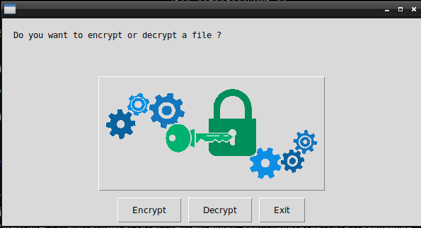
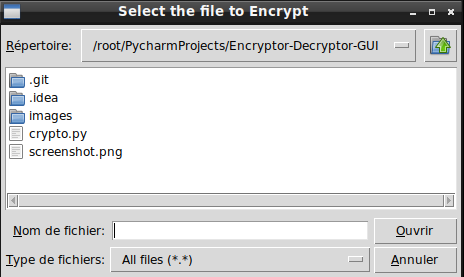

# Encryptor - Decryptor with GUI

## What's this software ?  

This software is writed in Python 3. The first time you open the software it will ask you if you want to encrypt or decrypt a file. Once your choice is done, you have to select the file then enter a password to encrypt or decrypt.  


  





## What you need to make it work :

This game is made for Python 3.  

Install all the packages for : Python 3.  

easygui at least version 0.98  

```sh
sudo python3 -m pip install --upgrade easygui  
```  

```sh
sudo pip3 install crypto 
```  
```sh
sudo pip3 install pycrypto 
```  


## How to launch the Encryptor-Decryptor with GUI :

```sh
python3 crypto.py
```


## Developer - Author

Hamdy Abou El Anein

